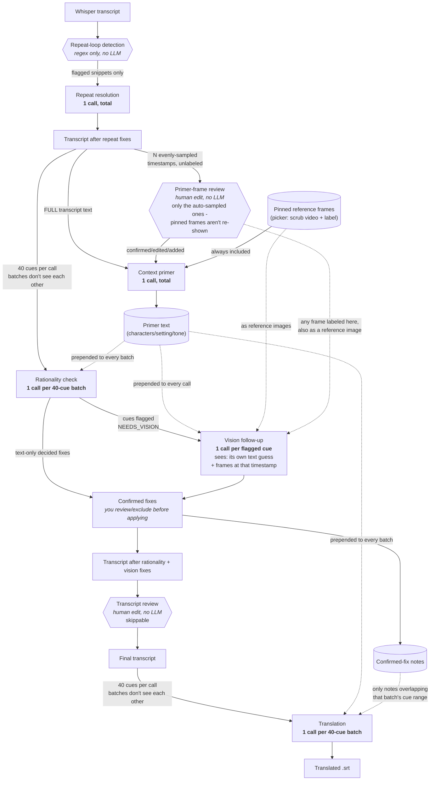

# LocalSub

Transcribe and translate foreign-language videos entirely locally - no cloud APIs - and
mux the result into an `.mkv` with selectable soft-subtitle tracks. Built on
[whisper.cpp](https://github.com/ggml-org/whisper.cpp) (GPU-accelerated via Vulkan, so it
works on AMD/Intel/NVIDIA, not just CUDA) for transcription, with an optional local-LLM
quality-check and translation pipeline on top (via [LM Studio](https://lmstudio.ai) or any
other OpenAI-compatible local server).

## What it does

1. Extracts audio and transcribes it with whisper.cpp.
2. Optionally cleans up the transcript with a local LLM in a few narrow, human-confirmed
   passes:
   - **Repeat-loop resolution** - whisper.cpp occasionally hallucinates a line and repeats
     it dozens of times in a row (or repeats a single character/syllable within one line,
     e.g. `ああああああ`). This is detected purely mathematically, then only the flagged
     snippets are sent to the LLM to decide how to fix them.
   - **Context primer** - one pass over the full transcript plus a handful of frames
     sampled evenly across the video, producing a short "characters/setting/tone" primer
     that gets used as context for the next two steps. You can also pin specific moments
     as labeled reference frames (e.g. a character's clear intro shot, scrubbed to via a
     real video player in the web UI) - these ride along with the primer and every later
     vision follow-up call, and you get a chance to review/relabel/retime/delete/add the
     automatically-sampled frames (though not the ones you already pinned - those were
     already deliberately curated) right before the primer call fires.
   - **Rationality check** - scans the cleaned transcript for anything garbled or
     implausible, asking the LLM to say whether it's confident in a text-only fix or
     needs to see the video at that moment.
   - **Vision follow-up** - only for the cues that asked for it, pulls a few frames from
     that exact moment and lets the LLM confirm or improve its guess.
   - You confirm/exclude each batch of proposed fixes before anything is applied.
   - **Transcript review** - a final pause before translation where you can fix anything
     the automated passes missed by hand (opens in `$EDITOR` on the CLI, an editable
     textarea in the web UI).
3. Translates the (now-cleaned) transcript, either via whisper.cpp's own built-in
   English-only translation, or via the local LLM for any target language (using the
   context primer and confirmed fixes as context).
4. Muxes the source-language and translated subtitle tracks into an `.mkv` alongside the
   original video/audio, untouched.

## What the LLM "remembers" at each stage

The local LLM has no built-in memory across calls - every request below is a single,
independent HTTP call with no chat history and no system prompt. Whatever context a stage
needs, the pipeline must explicitly paste back into that call's prompt as plain text. Only
two things get carried forward this way: the **context primer** and the **confirmed-fix
notes** - everything else is regenerated fresh, call by call.

Every write-back below overwrites the same `.srt` file in place - there's no "repeat-fix-only"
or "rationality-fix-only" snapshot that survives; each stage only ever reads whatever the
file currently contains.



| Stage | # of calls | Sees | Never sees |
|---|---|---|---|
| Repeat resolution | 1, total | only the flagged repeat/character-run snippets | the rest of the transcript, the primer, video frames |
| Primer-frame review | 1 pause, total | the N auto-sampled timestamps (not an LLM call - a human edit; pinned reference frames aren't shown here, they're already included regardless) | - |
| Context primer | 1, total | the full transcript (after repeat fixes) + the reviewed auto-sampled frames + any pinned reference frames | anything (it runs first - nothing to carry forward yet) |
| Rationality check | 1 per 40-cue batch | the primer + that batch's 40 cues (after repeat fixes) | other batches, video frames (text-only pass), repeat-resolution's decisions |
| Vision follow-up | 1 per flagged cue | the primer + any pinned/labeled reference frames (as images) + that cue's own issue/guess + frames from that exact moment | surrounding cues, any other flagged cue |
| Transcript review | 1 pause, total | the full transcript, after every automated fix (not an LLM call - a human edit) | - |
| Translation | 1 per 40-cue batch | the primer + notes relevant to that batch's cue range + that batch's 40 cues, **after every prior fix including any manual edit** | other batches' cues, or how they were translated |

Practical implication: the context primer and any notes are the *only* thread tying the
whole run together. A garbled fix in one rationality-check batch has no way to influence
another batch's output (good - it can't cascade), but it also means each batch judges
plausibility from its own 40 lines plus the primer alone, not the full transcript.

There's also an optional alternate VAD (voice-activity-detection) front end
([TEN VAD](https://github.com/TEN-framework/ten-vad)) that trims silence and detects
sentence boundaries more precisely than whisper.cpp's built-in Silero VAD - see
`--vad-engine ten` below.

## Hardware requirements

This covers whisper.cpp itself (the only non-optional stage - everything below assumes
`--no-llm-check --no-translate`/`--engine whisper`, i.e. no local LLM involved). The
optional LLM quality-check/translation/vision pipeline runs through a separate local
server (LM Studio or similar) and its requirements depend entirely on whatever model you
load there - not covered here.

- **GPU (optional, but recommended)**: `setup.sh` builds whisper.cpp with the Vulkan
  backend, so any Vulkan-capable GPU works - AMD, Intel, or NVIDIA, not just CUDA cards.
  Without a compatible GPU, pass `--no-gpu` (or it'll be used automatically if none is
  found) to fall back to CPU decoding - see benchmarks below for the real difference this
  makes.
- **VRAM**: the default `large-v3` model is ~2.9GB on disk, a reasonable proxy for its
  VRAM footprint - a few GB of headroom is enough. If your GPU can't fit it, use
  `--no-gpu` or a smaller `--model` (whisper.cpp also offers `medium`, `small`, `base`,
  `tiny` - smaller/faster but less accurate).
- **Disk**: the `large-v3` model file itself (~2.9GB), plus whisper.cpp's own build
  artifacts (a few hundred MB) and the small Silero VAD model (~1MB) if you use `--vad`.
- **CPU**: any modern multi-core CPU works as a fallback (`--threads` controls how many
  cores CPU decoding uses, default 12) - see benchmarks below for realistic throughput.
- **RAM**: not a practical bottleneck on any modern machine - a few free GB comfortably
  covers model loading and audio buffers.

## Performance

Real measurements, not estimates - transcription-only (`large-v3` model, no VAD, no LLM
pipeline), timed directly against `pipeline/whisper_engine.py`'s `transcribe()` on the
machine this was developed on:

**Hardware**: AMD Ryzen 9 7900 (12-core/24-thread), AMD Radeon RX 9070 XT (Vulkan
backend), 30GB RAM.

| Video length | GPU (Vulkan) | CPU-only (`--no-gpu`, 12 threads) |
|---|---|---|
| 30s (Japanese) | - | 10.1s (~3.0x real-time) |
| 60s (Japanese) | - | 16.3s (~3.7x real-time) |
| 11m 40s (Japanese) | 14.2s (~49x real-time) | - |
| 26m 20s (English) | 69.0s (~23x real-time) | - |

Takeaways:
- GPU decoding here was roughly an order of magnitude faster than CPU (~15-50x real-time
  vs. ~3-4x) - the real-time factor isn't a fixed multiplier, it varies with content
  (speech density, language, silence), not just duration, so treat the GPU numbers above
  as a realistic range rather than a single rate to extrapolate from.
- CPU-only is still comfortably faster than real-time on a modern desktop CPU, just not
  by nearly as much - fine for occasional use, GPU is worth having for anything longer or
  frequent.
- None of this includes the optional LLM-based quality-check/vision/translation stages -
  their cost depends entirely on the local LLM server and model you choose, and is
  already discussed in call-count terms in the table further up (each stage is either a
  small fixed number of calls or scales with cue count, not video length directly).

## Setup

```
./setup.sh
```

This clones and builds whisper.cpp (Vulkan backend), downloads the `large-v3` model and
the `silero-v6.2.0` VAD model, and installs the optional `ten-vad` package. It's safe to
re-run - each step is skipped if already done.

The one thing it doesn't do: install [LM Studio](https://lmstudio.ai) itself (it's a GUI
app). Install it, load a model, and start its local server (default
`http://localhost:1234/v1`) before using any of the LLM-based features below. Everything
LLM-related is optional - `--no-llm-check --no-translate` (or `--engine whisper`) skips it
entirely and only needs whisper.cpp.

## Usage

Basic transcription + English translation (whisper.cpp's own built-in translate):

```
python3 localsub.py your_video.mp4 --lang ja
```

Translate into a different target language via the local LLM, with the full
repeat/rationality/vision quality-check pipeline and a running context primer:

```
python3 localsub.py your_video.mp4 --lang zh --engine llm --target-lang es
```

Non-interactive/background run (accepts all LLM-proposed fixes without prompting):

```
python3 localsub.py your_video.mp4 --lang ja --engine llm --auto-confirm
```

Use the alternate TEN VAD engine (trims silence and preserves sentence boundaries more
precisely than whisper.cpp's built-in VAD - worth trying on fast back-to-back dialogue):

```
python3 localsub.py your_video.mp4 --lang ja --vad --vad-engine ten
```

Run `python3 localsub.py --help` for the full list of flags (whisper decoder
thresholds, VAD tuning, LLM endpoint/model, chunk sizes, etc.) - most have detailed
explanations of what they trade off inline in the help text.

## Web UI

```
python3 webui.py
```

Starts a local web server at `http://127.0.0.1:5000` with a form covering the same options
as the CLI flags, a live log of the run, and the repeat/rationality confirm steps rendered
as an actual checklist instead of typing an exclude-list into a terminal. It's a second,
independent entry point on top of the same `pipeline/` package - the CLI keeps working
exactly as documented above either way.

## Output

Everything for a given video is written into a `<video-stem>/` folder next to it (or
under `--workdir` if given): the extracted audio, source-language and translated `.srt`
files, the muxed `.output.mkv`, and (if the LLM pipeline ran) markdown logs of every LLM
request/response for each stage, including any frames sent for vision.

## License

MIT - see [LICENSE](LICENSE).
